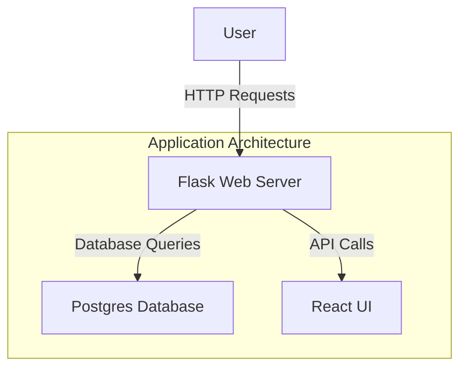
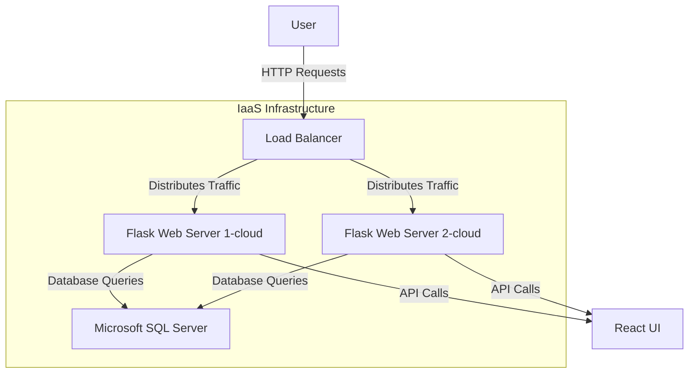
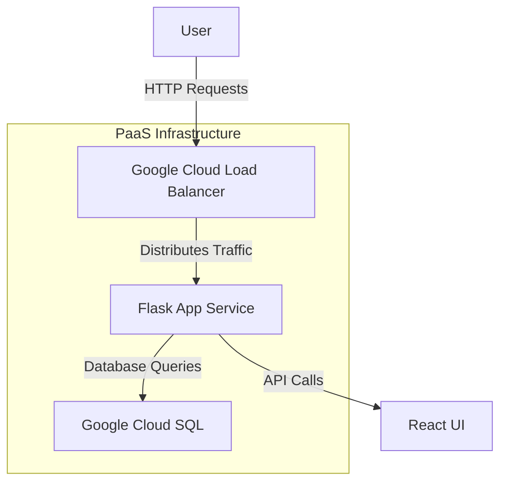

# Lab 2 - laaS/PaaS architecture 
# Application Architecture 
Based on the scenario explained in lab instruction, the application architecture consisting of a web server written in Flask, a UI front end written in React, and a database layer consisting of Postgres is represented in diagram below:
As shown in architecture below, the Flask Web Server connects users with the database. All of the user requests are fetched and saved to the Postgres Database, and React UI is updated to show or change information based on what users do.

Considering the above application is hosted on premise, moving to cloud would give option of following two architectures.
# IaaS Deployment Architecture

# Description:
1. Initially, **Users** send HTTP requests to the system.
2. The **Load Balancer** then receives these requests sent by users and distributes traffic across multiple web servers to make sure of balanced load and high availability.
3. The **web servers** (Flask Web Server 1 and Flask Web Server 2) are hosted on cloud, and both handle user requests, run the application, and fetch or update data in the Postgres Database. They also send and receive information to and from the React UI.
4. **Microsoft SQL Server** holds structured data such as user profiles, application state, and other important information. They are also responsible for executing SQL queries from Flask web servers to retrieve or modify data as per the user's need.
5. The **React UI** presents the user interface and receives API calls from the web servers.
6. In **IaaS**, we will be responsible for managing and setting up the load balancer, web servers, and database which increases the complexity of handeling the configuration, maintenance, and scaling of these components on our own. This approach gives more control over the infrastructure.

# PaaS Deployment Architecture

## Diagram

# Description:
1. **Users** are responsible for sending HTTP requests to the system.
2. The **Google Cloud Load Balancer** receives these requests and directs them to the **Flask App Service**.It distinguishes the architecture with IaaS since the web application is hosted as a service (AppService) rather than as individual web servers.GCLB is also responsible for distributes incoming HTTP requests from multiple users across multiple instances and it makes sure that application remains available even though one or more instances of App service runs through an error.
3. The **Flask App Service**, a PaaS-managed service, runs the Flask application. It handles HTTP requests, interacts with the **Google Cloud SQL** for data operations, and serves API calls to the **React UI**.
4. **Google Cloud SQL (CloudSQL)**: It is a managed and secured relational database service provided by Google Cloud. The Flask App Service associated with this architecture sends database queries to Cloud SQL to read from or write to the database.
5. The **React UI** interacts with the app service for API calls and presents the user interface to users.
6. In **PaaS**, the **load balancer** sends incoming requests to one app service (Flask App Service) instead of splitting them between several web servers like in **IaaS**.
7. In **PaaS**, the service takes care of the load balancer, app service, and database, that makes us easy to focus on building our application instead of managing all of required parts.
   

